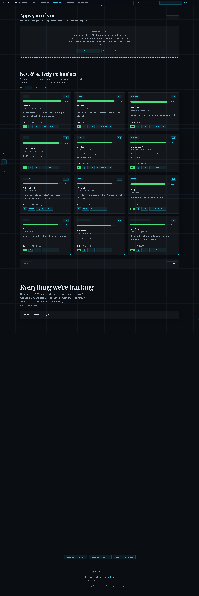
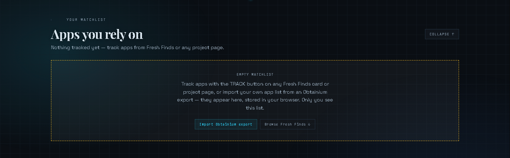

<p align="center">
  
</p>

<h1 align="center">📡 OSS Signal</h1>

<p align="center">
  <strong>🔍 A personal dashboard for tracking the open-source Android apps you rely on</strong><br/>
  <em>Transparent, mechanical health signals — no black box rankings</em>
</p>

<p align="center">
  <a href="https://oss-signal.vercel.app"></a>
  
  
  
  
</p>

> **🎯 Prioritize actively maintained FOSS Android apps.** Track the ones you rely on and discover the ones worth installing — every score is built from six transparent health signals. *Never install abandonware again.* 🚀

<p align="center">
  
</p>

<details>
<summary>📸 View Watchlist zone</summary>

</details>

---

## ✨ What it is

### 📋 Your Watchlist
The apps **you** actually use, tracked for:
- 🕒 **Staleness** — how long since the upstream repo was last pushed or released
- 🔄 **Updates** — whether a newer release exists than what you have installed
- ⚠️ **Abandonment risk** — a forward-looking signal, not just “is it maintained today”

### 🌱 Fresh Finds — <em>New & actively maintained</em>
Open-source projects launched in the last ~9 months that match your interests:
- ✨ Shizuku-enabled customization and utility apps
- 🛠️ FOSS Android tools (Termux, media, system utilities)
- 🎛️ Filterable by genre, access level, and risk profile

---

## 📊 Scoring — transparent, not a black box

Each project gets a composite score from **6 mechanical signals**:

| Signal | Weight | Source |
|--------|--------|--------|
| ⏱️ Recency (days since last push) | 24% | GitHub `pushed_at` |
| 📈 Momentum (stars ÷ repo age, absolute curve) | 20% | GitHub `stargazers_count` + `created_at` |
| 💬 Issue health (open issues minus open PRs) | 16% | GitHub Issues + Search API |
| 📄 License presence | 8% | GitHub `license` field |
| 👥 Contributor count (capped at 20) | 12% | GitHub Contributors API |
| 🚨 Abandonment risk | 20% | Computed: days-since-push + open issue response |

Plus 3 metadata flags:
- 🏷️ **Genre** — customization / shizuku / media / utility / productivity / security / store / education / dev-tools
- 🔌 **Shizuku** — whether the app requires Shizuku/root-adjacent access
- 🧩 **Generic** — whether the idea is common (notes/todo/calculator → needs social proof to surface)

---

## 🚀 Getting started

```bash
npm install
npm run dev
```

Open [http://localhost:3000](http://localhost:3000). 🎉

---

## 🔄 Data refresh

```bash
GITHUB_TOKEN=your_token node scripts/refresh-data.mjs
```

Fetches fresh finds (last 9 months), re-checks watchlist staleness, and writes `data/projects.json` + `data/watchlist.json`.

The GitHub Actions workflow (`.github/workflows/refresh-data.yml`) runs this every **6 hours ⏰**.

---

## 👤 Watchlist source

Empty by default — every visitor builds their own list in the browser (Track buttons or an Obtainium import); no personal app data ships in the repo. Contributors can grow the shared starter list by PR: replace `data/watchlist.json` with your export and the refresh workflow fills in staleness/versions.

---

## ☁️ Deploy

```bash
vercel deploy
```

Or push to the connected GitHub repository and Vercel handles it automatically. ✨

---

## 🧰 Tech stack

- ⚛️ **Next.js (App Router)** + React
- 🎨 **Tailwind CSS**
- 🎬 **Framer Motion** (animations)
- ☁️ **Vercel Hobby tier** (free)
- 🐙 **GitHub REST API** (data source)
- 🔍 **HN Algolia + Reddit** (social proof for generic/low-star ideas)

---

<p align="center">
  <sub>Built by <a href="https://github.com/Ritwik82">Ritwik</a> • <a href="https://github.com/Ritwik82/oss-signal">View on GitHub</a> • Scores are automated health signals, not endorsements</sub>
</p>
